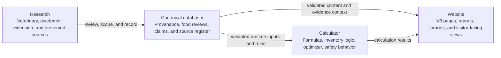
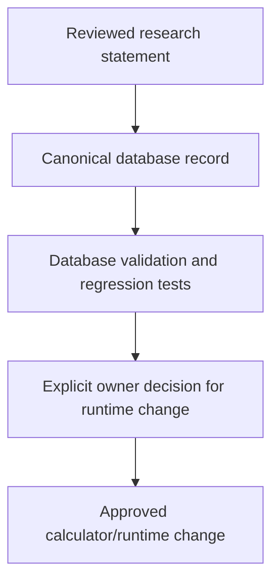

# Bird Feed Calculator Architecture

This document defines the intended high-level architecture for the Bird Feed Calculator. The central model is deliberately simple:

> **Research → canonical database → calculator and website**

Research is gathered and reviewed first. The reviewed information is stored in the repository’s canonical `database/` files. The calculator and website consume approved database/runtime data; they should not silently invent, rewrite, or bypass the database’s provenance and safety boundaries.

## Primary data flow



This is the product architecture at the level that matters for ownership and governance. The database is the shared boundary between research and product behavior. The calculator and website are downstream consumers; they are not alternate research stores.

## What is inside the canonical database

The `database/` directory stores the evidence and claims that must remain reviewable in GitHub. The key files are:

| Database component | Role in the flow |
|---|---|
| `database/provenance/sources.json` | Source register. It contains the named sources, URLs or DOIs, species scope, permitted use, limitations, and access dates. |
| `database/provenance/food-reviews.json` | Food/form evidence ledger. Each reviewed form has six explicit bird rows, source IDs, locators, rationales, outcomes, and processing boundaries. |
| `database/provenance/historical-claims.json` | Preserved historical claims and crosswalks. These protect research lineage but do not automatically become current approval. |
| `database/tools/validate-provenance-ledger.mjs` | Database validation. It checks source relationships, required bird rows, schema values, and ledger integrity. |

The source relationship is normalized inside the database. A statement does not repeat an entire URL; it stores a source ID that resolves to the matching source record:

```text
food-reviews.json
  ingredientReviews[].speciesEvidence[].sourceIds[]
        ↓ matching ID
sources.json
  sources[].id
        ↓
sources[].urlOrDoi
```

The `locator` field identifies the relevant section, table, paragraph, or result in the source. The `rationale` explains how the evidence supports the recorded outcome and why an exact species/form claim may remain unresolved.

Processing-level sources are linked through `processing.sourceIds[]`. They support preparation, form, toxicity, obstruction, or exclusion boundaries. They must not be mistaken for a species-level suitability approval.

## How the calculator consumes the database

The calculator is downstream of the database. Runtime modules such as `v3-webapp/client/src/lib/data.ts` and `v3-webapp/client/src/lib/bird-safety.ts` provide the active calculator inputs and safety behavior. The internal adapter in `v3-webapp/client/src/lib/ingredient-library.ts` can expose database evidence to product code, but unresolved research must not be converted into approval merely because it is present in the database.

A database update and a runtime update are therefore separate actions:



Adding a source or food-review record documents evidence. It does not, by itself, add an ingredient to active inventory, change a formula, alter optimizer selection, change hard safety behavior, or rewrite public-facing copy. A runtime change requires its own owner-approved scope, implementation, and validation.

## How the website consumes the database and calculator

The website is also downstream. It may display database-backed evidence, source links, reports, and library information, and it may display calculator results produced from approved runtime inputs. It should not maintain a conflicting copy of the research or claim that a profile-standard formula is the visitor’s actual inventory.

The intended relationship is:

| Consumer | Reads from | Responsibility |
|---|---|---|
| Calculator | Approved runtime data derived from reviewed database decisions | Calculate formulas, inventory results, optimizer output, and explicit safety behavior. |
| Website | Calculator results plus approved database-backed content | Present the product experience, evidence context, reports, and visitor-facing views. |
| Governance and tests | Database and runtime files | Verify provenance relationships and protect approved boundaries. |

## Non-negotiable boundaries

> **Research is not runtime approval, and runtime code is not the canonical research database.**

Each candidate food/form must be researched separately for pigeon, parrot, African Grey, budgie, canary, and chicken. Evidence must not be silently transferred from one species to another. Hard toxicity warnings, raw-adzuki warnings, preparation rules, and other explicit safety boundaries remain authoritative and visible where required.

The canonical database must remain the provenance knowledge base. The calculator and website may consume it, but they must not silently rewrite it, bypass it, or turn an unresolved outcome into compatibility approval. Public-facing wording requires explicit owner approval before it changes.

## Standard change sequence

1. Research the exact ingredient or claim and identify source-level evidence for all six supported birds.
2. Register each source and its limitations in `database/provenance/sources.json`.
3. Add the exact food/form or claim record to the appropriate canonical database file.
4. Link each statement to source IDs and a precise locator.
5. Run database validation and focused regression tests.
6. If product behavior must change, obtain explicit owner approval and make a separate calculator or website change that consumes the reviewed database result.

## Scope of this document

This document explains data ownership and flow. It does not define nutrient targets, formulas, active ingredient values, Firebase configuration, Firestore region, deployment behavior, or public-facing copy. Those remain governed by their respective files and owner-approved changes.
